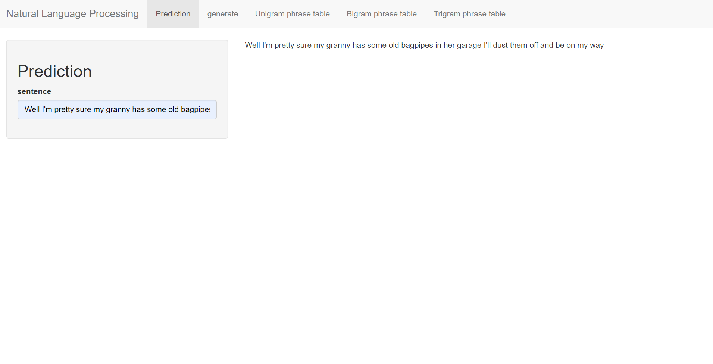
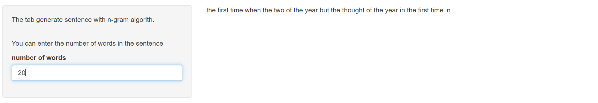
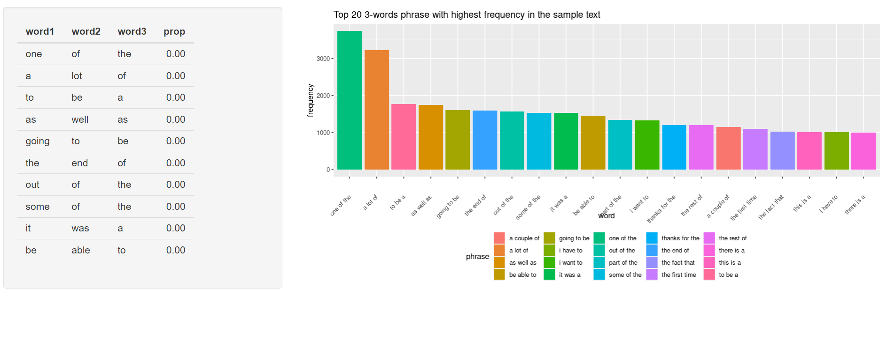

```{r setup, include=FALSE}
library(ggplot2)
library(gridExtra)
library(dplyr)
library(tidyr)
library(stringr)
library(tm)
knitr::opts_chunk$set(echo = TRUE)
knitr::opts_chunk$set(tidy.opts = list(width.cutoff = 20), tidy = TRUE)

```

## Prediction Model
This function use the unigram, bigram and trigram to predict the next word.  
It will return the top 10 most probable result according to the n-grams.  
  
1. It first check if there is any row in the trigram match the last two words in the sentence.  If yes, it returns the top 10 highest proportion result.  

2. If there is no row in the trigram that matches the sentence, it check from the bigram and return the result if it can find any row that matches. 

3. If it still could not find any matches, it will return the top 10 highest frequency word in the unigram.

## Performance
```{r pred, echo=FALSE, cache=TRUE}
pt1 <- readRDS("ngramTable50/ngram1_phrase_table.rds")
pt2 <- readRDS("ngramTable50/ngram2_phrase_table.rds")
pt3 <- readRDS("ngramTable50/ngram3_phrase_table.rds")

predic <- function(sen, n, len)
{
  if (n == 1)
  {
    pt <- pt1
  }
  else if (n == 2)
  {
    pt <- pt2
  }
  else
  {
    pt <- pt3
  }
  
  if (n == 1)
  {
    return(pt[1:10,])
  }
  if (n == 2)
  {
    resPt <- pt[pt[,1] == sen[len],]
  }
  else
  {
    resPt <- pt
    for (i in 1:(n-1))
    {
      resPt <- resPt[resPt[,i] == sen[len-n+i+1],]
    }
  }
  if (nrow(resPt) ==0)
  {
    return(predic(sen, n-1, len))
  }
  else
  {
    return(resPt[1:10,] %>% na.omit())
  }
}

pred <- function(sen)
{
  sen <- sen %>% str_trim %>% removePunctuation() %>% tolower() %>% str_split(" ")
  sen <- sen[[1]]
  if (sen[1] == "")
  {
    return("")
  }
  len <- length(sen)
  n <- min(len+1, 3)
  res <- predic(sen, n, len)
  res[1,ncol(res)-1]
}
```

```{r test4.1, cache=TRUE}
start_time <- Sys.time()
pred("My granny has some old bagpipes in her garage I'll dust them off and be on my")
time_diff <- Sys.time() - start_time
```
The time used is `r format(time_diff)`

## User Interface


## Other functions
```{r plots, cache=TRUE, echo=FALSE}
p3 <- readRDS("plots/plot3.rds")
```
* Generate sentences
* N-grams phrase table and plot

